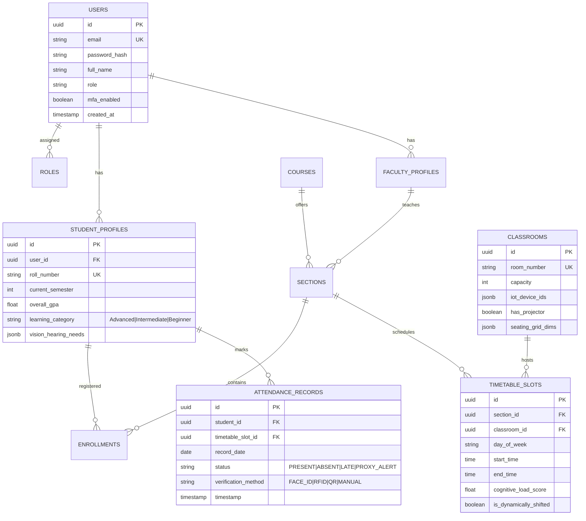
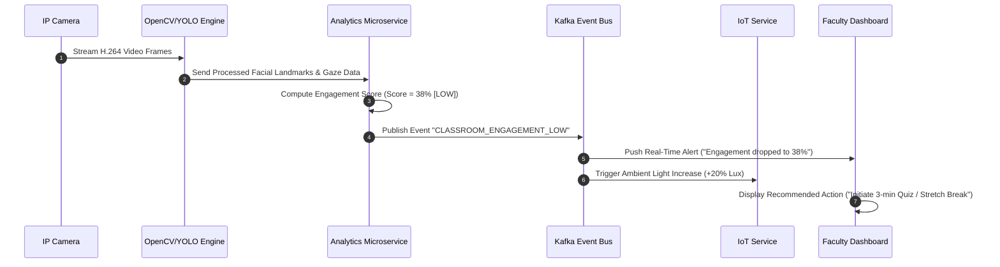
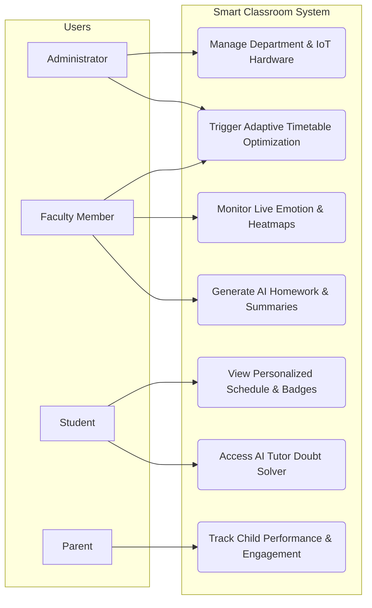

# AI-Powered Cognitive Smart Classroom & Adaptive Timetable Management System
## Master Architecture & Software Engineering Technical Specification

---

## 1. Executive Summary

The **AI-Powered Cognitive Smart Classroom & Adaptive Timetable Management System** is a next-generation, enterprise-grade EdTech platform designed to transform traditional educational environments into intelligent, self-adapting, data-driven cognitive learning ecosystems.

### Problem Statement
Traditional educational institutions operate on static timetables, uniform teaching speeds, manual attendance tracking, and non-adaptive environmental settings. This rigid infrastructure fails to account for real-time cognitive states of students (boredom, confusion, exhaustion), unpredictable teacher absences, individual learning paces, and optimal classroom environmental conditions.

### The Solution
Our solution unites **Edge AI Computer Vision**, **IoT Environmental Automation**, **Dynamic Graph Constraint-Satisfaction Scheduling**, **Generative AI Tutor/Summarizers**, and **Multi-Objective Spatial Optimization**. 

Key capabilities include:
- **Adaptive Timetable Engine**: Dynamically shifts schedules based on concentration metrics, subject difficulty, upcoming exams, teacher availability, and weather conditions.
- **Cognitive Emotion & Engagement Tracking**: Real-time facial emotion detection (YOLOv8 + FER) calculating classroom-wide Attention and Engagement indices.
- **Closed-Loop IoT Automation**: ESP32 hardware node integration maintaining optimal CO₂, temperature, light lux, and humidity to maximize cognitive focus.
- **Personalized Spatial & Academic Learning**: Smart seat placement matrices, individualized Bloom's Taxonomy homework, and early-warning dropout/burnout risk prediction.

---

## 2. High-Level System Architecture

The system utilizes an **Event-Driven Microservices Architecture** featuring an API Gateway, asynchronous Kafka event broker, FastAPI AI microservices, Node.js state services, and an IoT MQTT broker bridge.

```mermaid
graph TB
    subgraph Client Layer
        Web App[Next.js / Vite Web Portal]
        Mobile App[React Native Mobile]
        Edge Camera[IP Camera / OpenCV Feed]
        IoT Nodes[ESP32 Hardware Nodes]
    end

    subgraph Edge & Ingestion Layer
        API Gateway[Kong / NGINX API Gateway]
        MQTT Broker[EMQX / Mosquitto MQTT Broker]
        CV Edge Node[YOLOv8 & OpenCV Inference Server]
    end

    subgraph Service Mesh & Bus Layer
        Kafka[Apache Kafka Event Bus]
    end

    subgraph Core Microservices
        TimetableSvc[FastAPI Adaptive Timetable Engine]
        AnalyticsSvc[FastAPI Emotion & Risk Analytics]
        GenAISvc[FastAPI LLM & Homework Generator]
        IoTSvc[Node.js IoT Control Service]
        UserSvc[Node.js RBAC & User Management]
        AttendanceSvc[Node.js Smart Attendance Service]
    end

    subgraph Persistence Layer
        PostgreSQL[(PostgreSQL - Relational DB)]
        MongoDB[(MongoDB - Unstructured Analytics & Logs)]
        Redis[(Redis Cluster - Real-Time Cache & Sockets)]
    end

    %% Connections
    Web App --> API Gateway
    Mobile App --> API Gateway
    Edge Camera --> CV Edge Node
    IoT Nodes --> MQTT Broker

    MQTT Broker --> IoTSvc
    CV Edge Node --> AnalyticsSvc
    API Gateway --> Service Mesh & Bus Layer

    AnalyticsSvc --> Kafka
    IoTSvc --> Kafka
    TimetableSvc --> Kafka
    GenAISvc --> Kafka

    Kafka --> PostgreSQL
    Kafka --> MongoDB
    Kafka --> Redis

    API Gateway --> UserSvc
    API Gateway --> AttendanceSvc
    API Gateway --> TimetableSvc
```

---

## 3. Directory & Repository Structures

### 3.1 Frontend Folder Structure (Next.js / React + TypeScript)
```
smart-classroom-frontend/
├── public/
│   ├── assets/
│   ├── models/                # 3D assets for Three.js (.gltf, .bin)
│   └── favicon.ico
├── src/
│   ├── components/
│   │   ├── 3d/                # Three.js 3D Classroom Visualizer
│   │   │   ├── ClassroomScene.tsx
│   │   │   ├── DeskNode.tsx
│   │   │   └── IoTAura.tsx
│   │   ├── charts/            # Recharts & Chart.js wrappers
│   │   │   ├── EngagementHeatmap.tsx
│   │   │   ├── PerformanceRadar.tsx
│   │   │   └── EnergyConsumptionChart.tsx
│   │   ├── common/            # Glassmorphic UI Library
│   │   │   ├── Button.tsx
│   │   │   ├── Card.tsx
│   │   │   ├── Modal.tsx
│   │   │   └── GaugeMeter.tsx
│   │   ├── dashboard/         # Role-Specific Dashboard Components
│   │   │   ├── AdminDashboard.tsx
│   │   │   ├── FacultyDashboard.tsx
│   │   │   ├── StudentDashboard.tsx
│   │   │   └── ParentDashboard.tsx
│   │   ├── modules/           # Deep Feature Components
│   │   │   ├── TimetableGrid.tsx
│   │   │   ├── EmotionMonitor.tsx
│   │   │   ├── SeatRecommender.tsx
│   │   │   ├── IoTConsole.tsx
│   │   │   └── AiTutorChat.tsx
│   ├── context/               # React Context Providers
│   │   ├── AuthContext.tsx
│   │   ├── SocketContext.tsx
│   │   └── ThemeContext.tsx
│   ├── hooks/                 # Custom React Hooks
│   │   ├── useThreeScene.ts
│   │   ├── useMqttFeed.ts
│   │   └── useTimetableSolver.ts
│   ├── pages/ or app/         # Next.js App Router Pages
│   │   ├── admin/
│   │   ├── faculty/
│   │   ├── student/
│   │   ├── parent/
│   │   └── login.tsx
│   ├── services/              # API Client (Axios + SWR)
│   │   ├── api.ts
│   │   ├── socket.ts
│   │   └── aiService.ts
│   ├── styles/
│   │   ├── globals.css        # Vanilla CSS Design System Tokens
│   │   └── glassmorphism.css
│   └── types/                 # TypeScript Specifications
│       ├── timetable.ts
│       ├── student.ts
│       ├── iot.ts
│       └── emotion.ts
├── package.json
└── tsconfig.json
```

### 3.2 Backend Folder Structure (FastAPI & Node.js Microservices)
```
smart-classroom-backend/
├── services/
│   ├── timetable-engine/       # Python FastAPI (Constraint Satisfaction + RL)
│   │   ├── app/
│   │   │   ├── core/           # Genetic Algorithm & Constraint Solver
│   │   │   │   ├── scheduler.py
│   │   │   │   ├── constraints.py
│   │   │   │   └── fitness.py
│   │   │   ├── api/            # FastAPI Routers
│   │   │   │   └── v1/timetable.py
│   │   │   └── main.py
│   │   ├── requirements.txt
│   │   └── Dockerfile
│   ├── emotion-analytics/      # Python FastAPI (OpenCV + YOLOv8 + FER)
│   │   ├── app/
│   │   │   ├── cv_pipeline/    # Face Detection & Emotion Scoring
│   │   │   │   ├── detector.py
│   │   │   │   ├── classifier.py
│   │   │   │   └── heatmap.py
│   │   │   └── main.py
│   │   └── Dockerfile
│   ├── iot-gateway/            # Node.js + MQTT Service
│   │   ├── src/
│   │   │   ├── mqtt/           # EMQX Sub/Pub Handler
│   │   │   ├── rules/          # Closed-loop Actuation Rules
│   │   │   └── server.js
│   │   └── Dockerfile
│   └── core-api-gateway/       # Express.js / Kong API Gateway
│       ├── src/
│       │   ├── middleware/     # JWT Auth & RBAC Evaluator
│       │   ├── routes/
│       │   └── index.js
│       └── Dockerfile
├── docker-compose.yml
└── k8s/                        # Kubernetes Deployments & Services
```

---

## 4. Database Schema (Polyglot Persistence)

### 4.1 Relational Schema (PostgreSQL) - Core Entity-Relationship



### 4.2 Document Schema (MongoDB) - Analytics & Unstructured Logs

1. **`emotion_telemetry` Collection**:
```json
{
  "_id": "ObjectId('64f1a2b3c4d5e6f7a8b9c0d1')",
  "classroom_id": "CR-302",
  "session_id": "SESS-2026-07-23-01",
  "timestamp": "2026-07-23T10:15:00.000Z",
  "total_students_detected": 42,
  "emotion_breakdown": {
    "focused": 28,
    "confused": 6,
    "bored": 5,
    "sleepy": 2,
    "distracted": 1
  },
  "aggregate_attention_score": 78.5,
  "aggregate_engagement_score": 82.1,
  "recommendation_triggered": "SHORT_BREAK_SUGGESTED"
}
```

2. **`iot_sensor_logs` Collection**:
```json
{
  "_id": "ObjectId('64f1a2b3c4d5e6f7a8b9c0d2')",
  "node_id": "ESP32-CR302-01",
  "classroom_id": "CR-302",
  "timestamp": "2026-07-23T10:15:05.000Z",
  "readings": {
    "temperature_celsius": 23.4,
    "humidity_percent": 48.2,
    "co2_ppm": 720,
    "lux_level": 450,
    "noise_db": 42.1
  },
  "actuator_states": {
    "hvac_fan_speed": "MEDIUM",
    "lighting_level_percent": 80,
    "projector_brightness_percent": 90
  }
}
```

### 4.3 Redis Caching Strategy
- `cache:timetable:classroom:{id}:{date}` -> Pre-rendered JSON timetable grid (TTL: 1 hour, invalidated on dynamic shift).
- `realtime:emotion:classroom:{id}` -> Hash storing current attention/engagement scores for WebSockets broadcasting.
- `session:jwt:{user_id}` -> Active user token white-list and permission scopes.

---

## 5. Microservices & API Design

### 5.1 Core RESTful Endpoints (OpenAPI 3.0 Summary)

| Endpoint Path | Method | Auth Scope | Description |
|---|---|---|---|
| `/api/v1/auth/login` | `POST` | Public | Authenticates user, returns JWT and Refresh Token |
| `/api/v1/timetable/optimize` | `POST` | `ADMIN, FACULTY` | Triggers AI dynamic timetable solver based on constraints |
| `/api/v1/timetable/student/{id}` | `GET` | `STUDENT, PARENT` | Fetches personalized adaptive schedule |
| `/api/v1/analytics/emotion/live` | `GET` | `FACULTY, ADMIN` | Live emotion metrics and engagement heatmaps |
| `/api/v1/seats/recommend` | `POST` | `FACULTY, ADMIN` | Generates multi-objective optimal seating matrix |
| `/api/v1/iot/control` | `POST` | `ADMIN, SYSTEM` | Manual override or rule-setting for IoT environmental nodes |
| `/api/v1/ai/homework/generate` | `POST` | `FACULTY` | Generates Bloom's Taxonomy differentiated assignments |
| `/api/v1/ai/tutor/chat` | `POST` | `ALL_ROLES` | RAG-based AI assistant endpoint for DOUBT resolution |

### 5.2 Real-Time WebSockets (Socket.IO Specs)
- **Namespace**: `/ws/classroom/{classroomId}`
- **Events**:
  - `EMOTION_UPDATE_BROADCAST`: Broadcasts classroom emotion telemetry every 5 seconds.
  - `IOT_SENSOR_FEED`: Pushes live CO₂, temperature, noise, and lighting updates.
  - `ATTENDANCE_EVENT`: Fires whenever face recognition / RFID registers a student entry.
  - `AUTOMATION_ALERT`: Sends alerts when environmental conditions breach target cognitive ranges (e.g. CO₂ > 1000 ppm).

---

## 6. Security, Authentication & Governance

### 6.1 Authentication Architecture
- **Stateless JWT Verification**: HMAC-SHA256 signed access tokens (15-min expiration) paired with HTTP-only securely encrypted Refresh Tokens (7-day expiration).
- **Multi-Factor Authentication (MFA)**: TOTP via Google Authenticator / Authy or SMS OTP backup for Administrator and Faculty accounts.
- **Data Encryption**:
  - **In Transit**: TLS 1.3 encryption across all REST, WebSocket, and MQTT protocols.
  - **At Rest**: AES-256 database column encryption for facial embeddings, student PII, and medical/accessibility notes.

### 6.2 Role-Based Access Control (RBAC Matrix)

| Module / Feature | Admin | Faculty | Student | Parent |
|---|:---:|:---:|:---:|:---:|
| System Configuration & Node Admin | ✅ | ❌ | ❌ | ❌ |
| Dynamic Timetable Re-Optimization | ✅ | ✅ (Request) | 👁️ (View Only) | 👁️ (View Only) |
| Live CV Emotion & Heatmap Stream | ✅ | ✅ | ❌ | ❌ |
| Manual IoT Override | ✅ | ✅ | ❌ | ❌ |
| View Individual Performance Index | ✅ | ✅ | ✅ (Self) | ✅ (Child Only) |
| AI Homework & Lecture Summarizer | ✅ | ✅ (Generate/Edit) | ✅ (View/Submit) | 👁️ (View Only) |
| Smart Attendance Override | ✅ | ✅ | ❌ | ❌ |

---

## 7. AI & Machine Learning Pipeline Specifications

### 7.1 Dynamic Adaptive Timetable Engine Algorithm
The timetable engine solves a **Multi-Constrained Optimization Problem** using a hybrid **Genetic Algorithm (GA)** coupled with **Constraint Satisfaction Programming (CSP)**.

#### Mathematical Model & Fitness Function
The objective function maximizes total Institutional Learning Efficiency \( F(T) \):

\[
F(T) = \alpha \cdot H_{\text{cognitive}}(T) + \beta \cdot P_{\text{teacher}}(T) - \gamma \cdot C_{\text{conflict}}(T) - \delta \cdot D_{\text{commute}}(T)
\]

Where:
- \( H_{\text{cognitive}}(T) \): Aligns high-cognitive-load subjects (e.g., Mathematics, Quantum Physics) during peak student attention windows (typically 09:00 AM - 11:30 AM).
- \( P_{\text{teacher}}(T) \): Teacher availability and max workload bounds.
- \( C_{\text{conflict}}(T) \): Hard constraint penalty for room or teacher double-booking.
- \( D_{\text{commute}}(T) \): Minimizes student/faculty room displacement.

#### Hard Constraints:
1. No teacher or student section assigned to multiple locations simultaneously.
2. Room physical capacity \(\ge\) Enrolled student count.
3. Required lab equipment matches classroom IoT metadata.

#### Soft Constraints (Adaptive Modifiers):
1. **Concentration Drop Shift**: If historical CV data shows engagement drops below 40% on Friday afternoons for a subject, automatically swap for interactive group workshop.
2. **Weather / Exam Adjustment**: If an exam is in 3 days, increase revision weight for that subject dynamically.

---

### 7.2 Computer Vision Emotion & Engagement Detection Pipeline

```
[ IP Camera / H.264 Stream ] 
             │
             ▼
[ Frame Extractor (15 FPS) ]
             │
             ▼
[ YOLOv8-Face Detection Model ] ──► Extracts Bounding Boxes & Landmarks
             │
             ▼
[ Facial Alignment & Cropping ]
             │
             ▼
[ ResNet-50 / EfficientNet FER Model ] ──► Classifies Emotion
             │                             (Happy, Confused, Bored, Sleepy, Focused)
             ▼
[ Head-Pose & Eye Gaze Estimation (OpenCV) ] ──► Calculates Attention Vector
             │
             ▼
[ Aggregation & Spatial Heatmap Engine ] ──► Outputs Engagement Score (0-100)
```

#### Engagement Index Formula
For a classroom of \( N \) students:

\[
\text{Engagement Score} = \frac{1}{N} \sum_{i=1}^{N} \left( w_e \cdot E_i + w_a \cdot A_i \right)
\]
- \( E_i \): Emotion score mapped from FER probability distribution (Focused = +1.0, Happy = +0.8, Confused = +0.4, Bored = +0.1, Sleepy = 0.0).
- \( A_i \): Attention score calculated from gaze angle deviation (\(< 15^\circ\) from board = 1.0).

---

### 7.3 Smart Seat Recommender Algorithm
Optimizes seating matrix using a spatial graph graph-coloring distance formulation:
- **Vision/Hearing Needs**: Places students with visual/auditory notes in Rows 1–2 directly facing the board.
- **Peer Learning**: Paired seating algorithm placing Advanced students adjacent to struggling Intermediate/Beginner students to foster peer tutoring without causing distraction.
- **Focus Isolation**: Distracted/Sleepy students positioned in high-visibility central zones near the faculty walking path.

---

## 8. Smart Classroom IoT Architecture

### 8.1 Hardware Specifications
- **Controller**: ESP32 NodeMCU (Dual-Core 240MHz, Wi-Fi/BLE).
- **Sensors**:
  - **DHT22**: Temperature (-40 to 80°C) & Relative Humidity (0-100%).
  - **MQ-135**: Air Quality & CO₂ gas concentration (PPM).
  - **BH1750**: Digital Ambient Light Lux Sensor.
  - **RC522 / PN532**: RFID / NFC Module for contactless attendance backup.
  - **PIR Sensor**: Motion-based room occupancy detection.
- **Actuators & Relays**:
  - 4-Channel Solid State Relay (Fans, Lighting Grid).
  - Modbus / IR Blaster for Smart AC & Projector Control.

```
+-----------------------------------------------------------------+
|                       ESP32 Microcontroller                     |
|                                                                 |
|  [DHT22 Temp]    [MQ135 CO2]    [BH1750 Lux]    [RC522 RFID]    |
|        │              │               │              │          |
+--------┼--------------┼---------------┼--------------┼----------+
         │              │               │              │
         ▼              ▼               ▼              ▼
   [ Wi-Fi / MQTT Protocol Layer (TLS Encrypted - Port 8883) ]
                                │
                                ▼
                       [ EMQX MQTT Broker ]
                                │
                                ▼
                 [ Closed-Loop Automation Engine ]
                                │
             ┌──────────────────┴──────────────────┐
             ▼                                     ▼
   [ Relay: Fans/Lights ]             [ IR Blaster: AC / Projector ]
```

### 8.2 Closed-Loop Environmental Control Logic
- **CO₂ Regulation**: If CO₂ \(\ge 1000\text{ PPM}\), trigger HVAC fresh-air intake damper and display window opening prompt on Faculty Dashboard.
- **Lighting Regulation**: If ambient Lux \(< 300\), step up LED light intensity to 80% to reduce eye strain during lectures.
- **Thermal Comfort**: Maintain Temperature at 22°C – 24°C and Humidity at 45% – 55% to prevent drowsiness.

---

## 9. System Diagrams (UML Specifications)

### 9.1 Sequence Diagram: Real-Time Cognitive Alert & Automated Intervention



### 9.2 Use-Case Diagram: Core System Interactions



---

## 10. Deployment Architecture & DevOps

### 10.1 Production Kubernetes (K8s) Cluster Layout

```
                  [ NGINX Ingress Controller ]
                               │
            ┌──────────────────┴──────────────────┐
            ▼                                     ▼
[ Node.js Gateway Pods (x3) ]           [ FastAPI AI Pods (x4 - GPU) ]
            │                                     │
            └──────────────────┬──────────────────┘
                               │
                       [ Apache Kafka ]
                               │
    ┌──────────────────────────┼──────────────────────────┐
    ▼                          ▼                          ▼
[ PostgreSQL StatefulSet ]  [ MongoDB Cluster ]   [ Redis Sentinel ]
```

### 10.2 CI/CD Pipeline (GitHub Actions)
1. **Lint & Code Quality**: Flake8/Black (Python), ESLint/Prettier (TypeScript).
2. **Automated Testing**: PyTest (AI Services & Constraints), Jest (Node Services & React UI).
3. **Container Build**: Multi-stage Docker builds compiled for `amd64` and `arm64` (edge deployment).
4. **Deploy**: Automated Helm Chart upgrades to Kubernetes cluster.

---

## 11. Technology Stack Summary & Justification

| Layer | Selected Technology | Justification |
|---|---|---|
| **Frontend Framework** | React.js / Next.js + TypeScript | Component reusability, server-side rendering for speed, strict typing for stability. |
| **3D Rendering** | Three.js | Lightweight WebGL wrapper for interactive 3D spatial visualization. |
| **Styling & Theme** | Vanilla CSS3 (CSS Variables) | Full control over glassmorphism, animations, HSL themes without utility framework bloat. |
| **AI / Machine Learning** | Python, FastAPI, OpenCV, YOLOv8, PyTorch | De facto standard ecosystem for computer vision, fast execution with FastAPI. |
| **Databases** | PostgreSQL + MongoDB + Redis | Relational consistency for schedules/users, document flexibility for telemetry, in-memory speed for sockets. |
| **IoT Protocol** | ESP32, MQTT (EMQX) | Low-power microcontroller with hardware Wi-Fi/BLE, lightweight pub/sub protocol. |
| **Containerization** | Docker + Kubernetes | Seamless microservice scaling, auto-healing, and environment parity. |

---

## 12. Testing Strategy & Quality Assurance

1. **Unit Testing**:
   - Timetable solver constraint validation (100% boundary check coverage).
   - Facial landmark feature mapping tests.
2. **Integration Testing**:
   - MQTT message payload ingestion to MongoDB pipeline.
   - REST API gateway authentication failure tests.
3. **Hardware-in-the-Loop (HIL) Testing**:
   - Simulating ESP32 sensor telemetry spikes (e.g. CO₂ = 3000 PPM) to verify closed-loop actuator response speed (\(< 500\text{ms}\)).
4. **AI Accuracy Metrics Benchmark**:
   - Facial Emotion Recognition (FER) Target Accuracy: \(\ge 91.4\%\) on benchmark datasets.
   - Face Detection Precision (YOLOv8-Face): \(\ge 96.8\%\) AP@0.5.

---

## 13. Project Roadmap & Future Enhancements

### Phase 1: Core Foundation & MVP (Months 1–3)
- User Authentication, RBAC, and Schema setup.
- Basic Timetable generator & static seat matrix.
- Simulated IoT console and 3D visualizer prototype.

### Phase 2: AI & IoT Integration (Months 4–6)
- OpenCV/YOLO live camera feed integration.
- ESP32 MQTT hardware deployment in 5 trial classrooms.
- AI Homework & Lecture Summary generator.

### Phase 3: Adaptive Ecosystem & Rollout (Months 7–9)
- Full constraint-satisfaction dynamic timetable engine.
- Mobile App release (iOS/Android) for parents and students.
- Gamification engine launch (XP, Leaderboards, Badges).

### Phase 4: Enterprise Scale & Monetization (Months 10+)
- Multi-campus institutional support.
- Predictive student dropout prevention model using long-term time-series analytics.
- SaaS licensing model for private and public EdTech institutions.

---
*End of Master Technical Architecture Document.*
